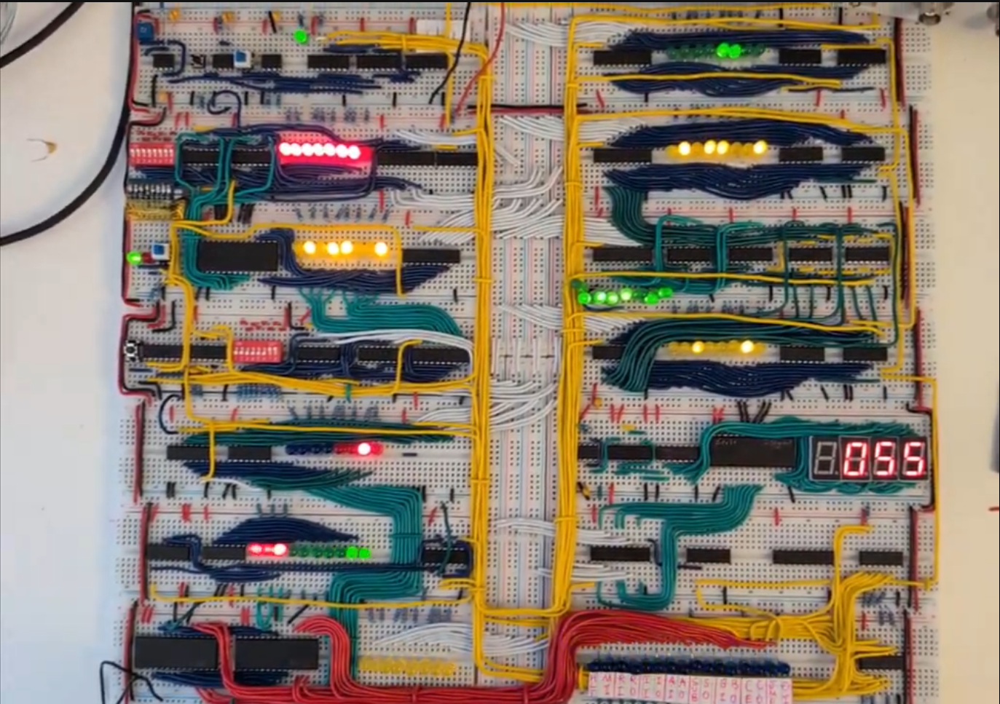
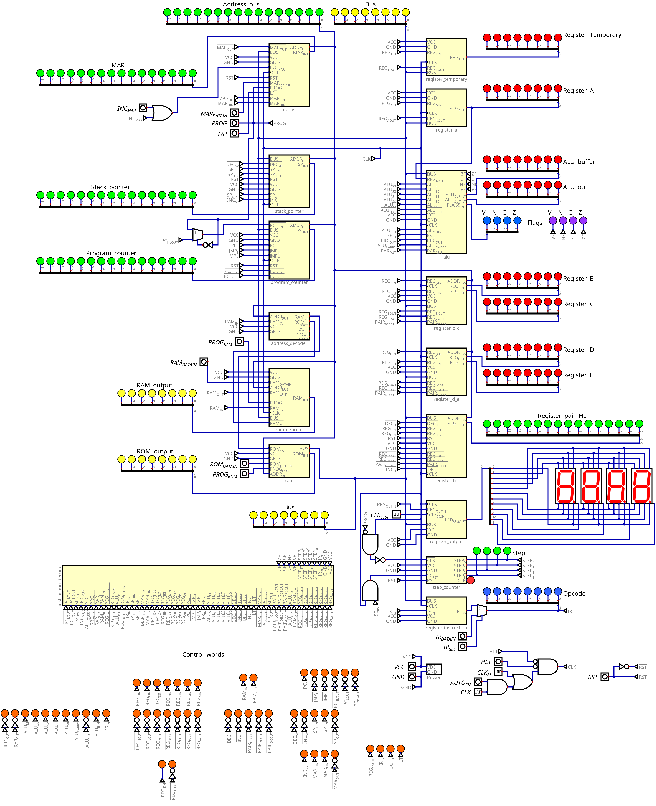
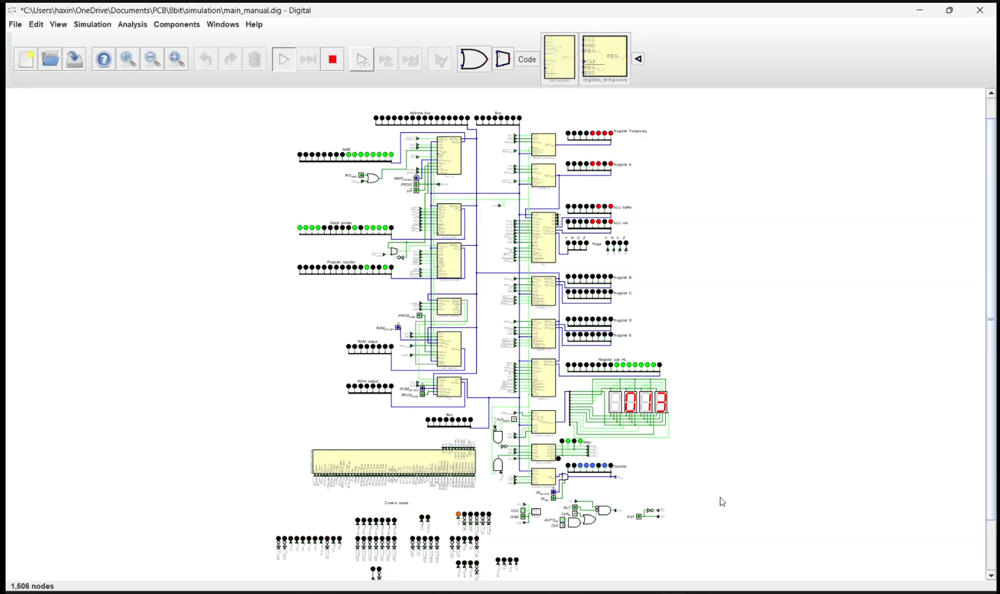

# 8bit
8-bit SAP-3 inspired architecture using 74xx series logic chips.

## Files
KiCad design files can be found at the root, clone and open `8bit.kicad_pro`.  
Simulation files for Digital can be found under `simulation/`.  
Some of the hex files to program EEPROMs are under `simulation/hex/`.  

## Features
- 8 bit wide data bus
- 16 bit wide address bus
- 8 bit A/B/C/D/E/H/L/temporary registers
- BC, DE, HL can pair up to become a 16 bit wide register
- 32k RAM
- Memory-Mapped IO
- 16 bit stack pointer, memory address register, program counter
- 8080-like instruction set
- CompactFlash read/write
- LCD output

## Demo
1. A simplified SAP-1 version running fibonacci sequence code. (Video)

2. SAP-3 in simulation

3. SAP-3 running fibonacci code

